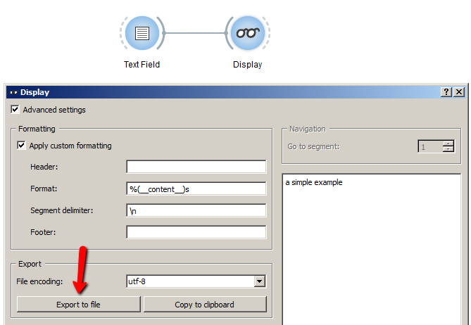

.. meta::
   :description: Orange Textable documentation, cookbook, export text content
   :keywords: Orange, Textable, documentation, cookbook, export, text,
              content, encoding

Export text content (and/or change text encoding)
=================================================

Goal
----

Export the content of a text (segmentation).

Prerequisites
-------------

Some text has been imported in Orange Textable (see :ref:`Cookbook: Text input
<cookbook_toc_text_input_ref>`) and possibly further processed (see
:ref:`Cookbook: Segmentation manipulation
<cookbook_toc_segmentation_manipulation_ref>`).

Ingredients
-----------

  ==============  =======
   **Widget**      :ref:`Display`
   **Icon**        |display_icon|
   **Quantity**    1
  ==============  =======

.. |display_icon| image:: figures/Display_36.png

Procedure
---------

.. _export_text_content_fig1:

   
   Figure 1: Export text with an instance of :ref:`Display`.

 
1. Create an instance of :ref:`Display` on the canvas.
2. Drag and drop from the output connection (righthand side) of the widget
   instance that emits the segmentation to be displayed (e.g.
   :ref:`Text Field`) to the :ref:`Display` instance's input connection
   (lefthand side).
3. Open the :ref:`Display` instance's interface by double-clicking on its
   icon on the canvas to view the imported text.
4. Tick the **Advanced settings** checkbox.
5. In the **Formatting** section, tick the **Apply custom formatting**
   checkbox.
6. In the **Export** section, you can choose the encoding for the text that
   will be exported using the **File encoding** drop-down menu.
7. Click on **Export to file** button to open the file selection dialog.
8. Select the location you want to export your file to and close the file 
   selection dialog by clicking on **Ok**.

Comment
-------

* If you rather want to *copy* the text content in order to later paste it in 
  another program, click on **Copy to clipboard**; note that in this case, 
  the encoding is by default utf8 and cannot be changed.
* If the input data contains *several* texts (segments) you can specify a
  string that will be inserted between each successive text in **Segment
  delimiter**; note that the default segment delimiter ``\n`` represents a
  carriage return.
* If the input data consist of a large number of segments (thousands or more),
  the time necessary to display them can be prohibitively long.
  
See also
--------

* :ref:`Reference: Display widget <Display>`
* :ref:`Cookbook: Text input <cookbook_toc_text_input_ref>`
* :ref:`Cookbook: Segmentation manipulation
  <cookbook_toc_segmentation_manipulation_ref>`

