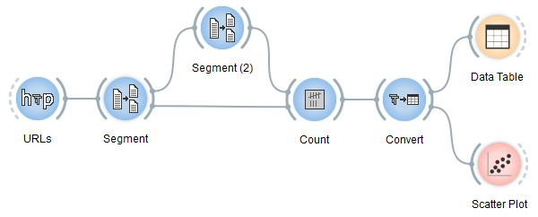

.. meta::
   :description: Orange Textable documentation, case study, Moby Dick
   :keywords: Orange, Textable, documentation, case study, Moby Dick, 
              term, frequency, comparison, Ahab, whales

Term frequency comparison in Melville's Moby Dick
=================================================

(This use case was designed with the help of `Douglas Duhaime 
<http://douglasduhaime.com/>`_ and the following text was slightly adapted from
a description kindly contributed by him.)

This case study is adapted from Matthew Jocker's excellent work *Text Analysis 
with R for Students of Literature* (46). The goal here is to visualize the 
frequency of the terms "Ahab" and "whale(s)" within Herman Melville's 
masterpiece *Moby Dick*. The workflow reproduced on :ref:`figure 1 
<moby_dick_schema>` below retrieves the text from `Project 
Gutenberg <https://www.gutenberg.org/>`_, splits the work into its constitutive 
chapters, and measures the degree to which each of the target terms appears in 
each chapter. [#]_

.. _moby_dick_schema:

    Figure 1: Orange Textable workflow for visualizing term frequency in *Moby Dick*.
    
Clicking on the **Scatter Plot** instance, one can easily see the relative 
frequency of the term *whale(s)* in each chapter of Melville's novel (see 
:ref:`figure 2 <moby_dick_whales_vs_ahab>` below). By toggling the **Y-axis 
Attribute** dropdown box, one can select *Ahab* and visualize the frequency of 
*Ahab* in the novel.

.. _moby_dick_whales_vs_ahab:

.. figure:: figures/moby_dick_freq_whales.png
    :align: center
    :scale: 75%
    :alt: Relative frequency of term "whale(s)" in Moby Dick

.. figure:: figures/moby_dick_freq_ahab.png
    :align: center
    :scale: 75%
    :alt: Relative frequency of term "Ahab" in Moby Dick

    Figure 2: Negative correlation between the relative frequency of terms *whale(s)* (top) and *Ahab* (bottom) in Melville's novel.    

Although one might have supposed that the distribution of Captain Ahab would 
closely resemble that of whales within the novel, the plots above tell a 
different story. While Ahab is most present in early and then later chapters, 
whales are most present in the novel's middle chapters, creating something of
an inverse relationship between the two. For the literary critic, this 
relationship offers new evidence with which to evaluate the strategy and 
structure of Melville's novel.
    
.. [#] The schema can be downloaded from :download:`here
       <schemas/moby_dick_for_textable_v3.1.3.ows>`.
