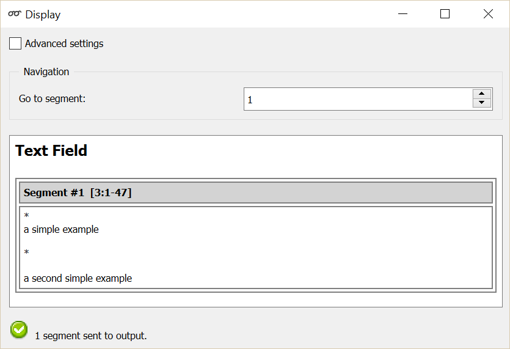
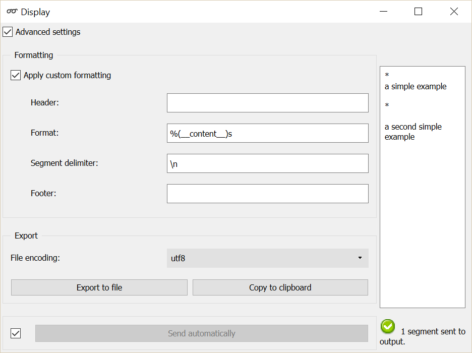

.. meta::
   :description: Orange Textable documentation, Display widget
   :keywords: Orange, Textable, documentation, Display, widget

.. _Display:

Display
=======

.. image:: figures/Display_54.png

Display or export the details of a segmentation.

Signals
-------

Inputs:

* ``Segmentation``

  Segmentation to be displayed or exported.

Outputs:

* ``Bypassed segmentation`` (default)

  Exact copy of the input segmentation

* ``Displayed segmentation``

  Segmentation covering the entire string displayed in the widget's interface

Description
-----------

This widget inputs a segmentation and displays on screen the content and the
annotation of the segments that compose it. The widget allows the user
notably to export the information in a text file. Moreover, it forwards the
segmentation without any modification on its output connections. [#]_

**Display** plays an essential role in schema construction: it is the best
way to check that the configuration of the other segmentation processing
widgets leads to the desired result in terms of segment and annotation
creation or modification.

It should be noted that for long segmentations, the widget may appear stuck
for a certain time after the progress bar has run -- a problem related to the
graphic interface library on which Orange Canvas relies. Unless memory
overflow occurs, the problem normally solves itself after a few moments.

Basic interface
~~~~~~~~~~~~~~~

In its basic version, the widget formats the input segmentation in HTML and
displays for each segment its number, its complete address (string index,
start and end positions) as well as its annotations (see
:ref:`figure 1 <display_fig1>`). The **Navigation** section enables the
program to directly show a particular segment using **Go to segment**.

.. _display_fig1:

    Figure 1: **Display** widget (basic interface).

It can be noted that the basic interface of **Display** is more sober than
those of the other widgets of Orange Textable: it does not include a **Send** button nor a **Send automatically** checkbox.
What motivates this design is the will to emphasize the fundamental
functionality of visualization of the input segmentation content and
annotations -- main reason for the use of **Display** in most cases. In this
context, by default, data are automatically sent on output connections.

Advanced interface
~~~~~~~~~~~~~~~~~~

The widget's advanced interface (see :ref:`figure 2 <display_fig2>`) restores
informative indications such as the number of segments in the input
segmentation or the reasons why no segmentation is emitted (for example
no input data) below the Text data window. The **Send** button triggers the emission of a segmentation to
the output connection(s). When it is selected, the **Send automatically**
checkbox disables the button and the widget attempts to automatically emit a
segmentation at every modification of its interface or when its input data are
modified (by deletion or addition of a connection, or because modified data is
received through an existing connection).

.. _display_fig2:

    Figure 2: **Display** widget (advanced interface).

The **Apply custom formatting** button enables the program to produce a
personalized rendering. In this mode, the formatting of each segment is
determined by a string entered in the **Format** field. This string can
contain text that will be reproduced as it is in the rendered output, as well
as references to variables to insert in the output. These references take the
following general form:

	*%(variable_name)format*
    
where *variable_name* designates the variable to insert and *format* the
desired format for this variable. For a basic use, all you need is to know
that the format code *s* designates a character string and *i* an integer.
[#]_ If the name of the variable is one of the following predefined strings,
it will be interpreted as indicated in the right column: [#]_

=====================  ===================================
 variable name          meaning
=====================  ===================================
 *__content__*          segment content
 *__num__*              segment number
 *__str_index__*        string index
 *__str_index_raw__*    string index counting from 0
 *__start__*            initial position
 *__start_raw__*        initial position counting from 0
 *__end__*              final position
=====================  ===================================

If on the contrary the name of the variable is not among those of the list,
the program will interpret it as an annotation key and will attempt to
display the corresponding value (or the string *__none__* if this key is not
defined for the considered segment).

The string entered in the **Segment delimiter** field, if any, will be
inserted between each segment of the formatted segmentation. Use the sequence
*\n* for a line break and *\t* for tabulation.

The **Header** and **Footer** fields enable the user to specify strings that
will be inserted respectively at the beginning and the end of the formatted
segmentation.

To take a simple example, consider the following (extract of a) segmentation
of the string *a simple example* [#]_:

=========  =======  =====  ===================
 content    start    end    *letter category*
=========  =======  =====  ===================
 *a*        1        1      *vowel*
 *s*        3        3      *consonant*
 *i*        4        4      *vowel*
 ...        ...      ...    ...
 *e*        16       16     *vowel*
=========  =======  =====  ===================

By entering:

* ``<word>\n`` in the **header** field,
* ``<letter pos="%(__num__)i" type="%(letter category)s">%(__content__)s</letter>``
  in the **format** field,
* ``\n`` in the **segment delimiter** field, and
* ``\n</word>`` in the **footer** field,

we obtain the following formatting:

::

    <word>
    <letter pos="1" type="vowel">a</letter>
    <letter pos="2" type="consonant">s</letter>
    <letter pos="3" type="vowel">i</letter>
    <letter pos="4" type="consonant">m</letter>
    <letter pos="5" type="consonant">p</letter>
    <letter pos="6" type="consonant">l</letter>
    <letter pos="7" type="vowel">e</letter>
    <letter pos="8" type="vowel">e</letter>
    <letter pos="9" type="consonant">x</letter>
    <letter pos="10" type="vowel">a</letter>
    <letter pos="11" type="consonant">m</letter>
    <letter pos="12" type="consonant">p</letter>
    <letter pos="13" type="consonant">l</letter>
    <letter pos="14" type="vowel">e</letter>
    </word>

The **Export** section of the widget interface also allows the user to export
the displayed segmentation (standard HTML or user-defined format) in a file.
The encoding can be selected (**Encoding**) then click on **Export** to open
a file selection dialog. By clicking the **Copy to clipboard** button, the
user may also to copy the displayed segmentation in order to paste it in
another application for instance; in this case, the utf-8 encoding is used by
default.

When the option **Apply custom formatting** is not selected, the
**Navigation** section is enabled and allows the user to view a particular
segment through the **Go to segment** control.

Messages
--------

Information
~~~~~~~~~~~

*Data correctly sent to output: <n> segments.*
    This confirms that the widget has operated properly.

*Settings were* (or *Input has*) *changed, please click 'Send' when ready.*
    Settings and/or input have changed but the **Send automatically** checkbox
    has not been selected, so the user is prompted to click the **Send**
    button (or equivalently check the box) in order for computation and data
    emission to proceed.

*No data sent to output yet: no input segmentation.*
    The widget instance is not able to emit data to output because it receives
    none on its input channel(s).

*No data sent to 'Displayed segmentation' channel, see 'Widget state' below.*
    A problem with the 'Format' parameter prevents this widget instance
    from operating properly, and additional diagnostic information can be
    found in the **Widget state** box at the bottom of the instance's
    interface (see and `Errors`_ below).

Errors
~~~~~~

*Format mismatch error: a <variable_type> is required.*
    In the advanced interface, the string entered in the **Format** field 
    indicates that a variable of a certain type (e.g. float) is expected,
    but in at least one case, the corresponding value is of another type 
    (e.g. string). The string type (e.g. ``%(__content__)s``) is usually the 
    safest bet.

*Format mismatch error: not enough arguments for format string.*
    In the advanced interface, the string entered in the **Format** field 
    indicates that a variable is expected but in at least one case, there is
    no corresponding value. Make sure that no placeholder is used without an 
    explicit name (always use e.g. ``%(__content__)s``, and never ``%s``).

*Format error: missing variable type.*
    In the advanced interface, a variable type indication is missing in the 
    string entered in the **Format** field. Make sure that no placeholder is 
    used without a variable type indication (always use e.g. 
    ``%(__content__)s``, and never ``%(__content__)``).

*Format error: missing name.*
    In the advanced interface, a variable name is missing in the string entered 
    in the **Format** field. Make sure that no placeholder is used without a 
    variable name (always use e.g. ``%(__content__)s``, and never ``%()s``).
    
Examples
--------

* :doc:`Getting started: Keyboard input and segmentation display
  <keyboard_input_segmentation_display>`
* :doc:`Cookbook: Display text content <display_text_content>`
* :doc:`Cookbook: Export text content (and/or change text encoding)
  <export_text_content_change_encoding>`

Footnotes
---------

.. [#] The widget also sends, on a second channel not selected by default, a
       segmentation with a single segment containing the entire string as it
       is displayed in the widget's interface.
.. [#] For more details on the syntax of format codes, see `Python
       documentation
       <http://docs.python.org/library/stdtypes.html#string-formatting>`_.
.. [#] In general, predefined strings in Orange Textable have in common that
       they begin and end by two *underscore* characters (_); it is greatly
       recommended to avoid this form for every name supplied by the user (in
       particular for the segmentation labels, as well as for the keys and
       annotation values).
.. [#] By convention, we do not indicate here the string index associated with
       each segment but only its start and end positions, along with the
       annotation values associated with it; moreover, for the sake of
       readability, we do indicate the content of each segment, though it is
       not formally part of the segmentation (but rather of the string to
       which the segmentation refers).

