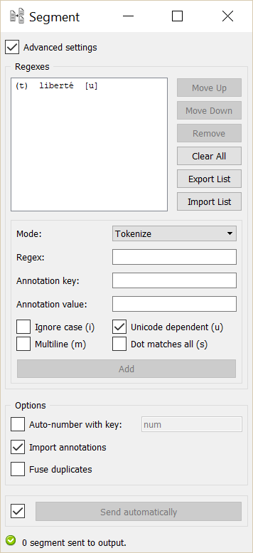

.. meta::
   :description: Orange Textable documentation, Segment widget
   :keywords: Orange, Textable, documentation, Segment, widget

.. _Segment:

Segment
=======

.. image:: figures/Segment_54.png

Subdivide a segmentation using regular expressions.

Signals
-------

Inputs:

* ``Segmentation``

  Segmentation that should be further segmented

* ``Message``

  JSON Message controlling the list of regular expressions

Outputs:

* ``Segmented data``

  Segmentation containing the newly created segments

Description
-----------

This widget inputs a segmentation and creates a new segmentation by
subdividing each original segment into a series of new segments. By default,
it works on the basis of a description of the form of the new segments (by
means of regular expressions); alternatively, it can also operate based on a
description of the separators that appear in-between the segments. It also
allows the user to create annotations for the output segments.

In the same way as for the :ref:`Recode` widget, it is possible to "capture"
text portions with square brackets used in a regular expression, notably to
copy them in the annotation key and/or in the associated value; for this we
use the notations ``&1``, ``&2``, etc. corresponding to the pairs of
successive brackets (numbered on the basis of the position of opening
parentheses) of the regular expression. [#]_

The interface of **Segment** is available in two versions, according to
whether or not the **Advanced Settings** checkbox is selected.

Basic interface
~~~~~~~~~~~~~~~

The basic version of the widget permits to choose between four types of Text Data segmentation output. 
The *Segment into Letters* option segments text data into letters; the *Segment into Words* option segments 
text data into words (which is mandatory in order to count segments, see cookbook); the *Segment into lines* option segments text data into lines.
Eventually, *Use a regular expression* opens a short Regex section (see :ref:`figure 1 <segment_fig1>` below). 
This Regex can be a particular string of characters (a word) or a regular expression. For instance,``\w+`` creates a
segment for each word of each input segment (to be precise: each continuous
sequence of alphanumerical characters and underscores). [#]_

.. _segment_fig1:

.. figure:: figures/segment_example.png
    :align: center
    :alt: Basic interface of the Segment widget

    Figure 1: **Segment** widget (basic interface).

The **Send** button triggers the emission of a segmentation to the output
connection(s). When it is selected, the **Send automatically** checkbox
disables the button and the widget attempts to automatically emit a
segmentation at every modification of its interface or when its input data are
modified (by deletion or addition of a connection, or because modified data is
received through an existing connection).

Below the **Send** button the user finds all the indications regarding the current status of the
widget instance (see `Messages`_ below, section `Information`_).

Advanced interface
~~~~~~~~~~~~~~~~~~

In its advanced version, the widget enables the user to define several regular
expressions and to determine the order in which they should successively be
applied to each segment of the input segmentation. It also allows the user to
specify if a given regular expression describes the form of the targeted
segments (**Tokenize** mode) or rather the form of the separators in-between
these segments (**Split** mode). [#]_

.. _segment_fig2:

    Figure 2: **Segment** widget (advanced interface).

The advanced interface (see :ref:`figure 2 <segment_fig2>` above) presents
similarities with that of the :ref:`Text Files`, :ref:`URLs`, and
:ref:`Recode` widgets. The **Regexes** section allows the user to define the
regular expressions applied successively to each segment of the input
segmentation and to determine their application order. In the list which
appears on top of the window, the columns indicate (a) the mode associated to
this regular expression, namely *t* for *Tokenize* (default) or *s* for
*Split*, (b) the actual expression, (c) the corresponding annotation (if any),
and (d) the options associated to this expression.

On :ref:`figure 2 <segment_fig2>` above, we can thus see that four regular
expressions have been defined, each in the **Tokenize** mode; each identifies
a type of character in the input segmentation and assigns to it an annotation
whose key is type. The character classes identified by the four expressions
are not mutually exclusive, however after having successively applied them,
the widget automatically sorts the segments (exactly like the **Sort
segments** option of the :ref:`Merge` widget) and fuses those whose addresses
are identical, given that the **Fuse duplicates** option is selected, which
triggers the fusion of segments with identical addresses (see below). In the
end, each character thus belongs to a single segment, whose value for the
annotation key *type* is the last one that was assigned to it according to the
regular expressions application order.

The first of the four expressions (``.``) creates a segment for each character
and assigns the annotation value *other* to it. The second (``\w``) creates a
segment for each alphanumerical character, and assigns the annotation value
*consonant* to it. The last two respectively identify vowels (``[aeiouy]``)
and digits (``[0-9]``) and annotate them as such. To illustrate the mechanism
explained in the previous paragraph, it can be noted that before segment
sorting and duplicate fusion, each vowel of the input segmentation is
associated with three segments whose values for the annotation key type are
(in order) *other*, *consonant*, and *vowel*; after sorting and fusion, only
the last of these values is retained.

The first buttons on the right of the list of regular expressions allow the
user to modify the order in which they are successively applied to each
segment of the input segmentation (**Move Up** and **Move Down**), to delete
an expression from the list (**Remove**) or to empty it entirely (**Clear
All**). Except for **Clear All**, all of these buttons require the selection
of an entry in the list beforehand. **Import List** enables the user to import
a list of regular expressions in JSON format (see :doc:`JSON im-/export format
<json_format>`, :doc:`Regular expression list <json_regular_expression_list>`)
and to add them to those already selected. **Export List** enables the user on
the contrary to export the list of regular expressions in a JSON file.

The remaining part of the **Regexes** section allows the user to add new
regular expressions to the list. To do so, the regular expression should be
specified (**Regex**) as well as, optionally, the annotation key and the
corresponding value (**Annotation key** and **value**). The **Ignore case
(i)**, **Unicode dependent (u)**, **Multiline (m)** and **Dot matches all
(s)** checkboxes control the application of the corresponding options to the
regular expressions. Adding the new regular expression to the list is executed
by finally clicking on the **Add** button.

Through the **Options** section, the **Auto-number with key** checkbox enables the program to
automatically number the output segments and to associate the number to the
annotation key specified in the text field on the right. The **Import
annotations** checkbox copies the annotations of each input segment to the
corresponding output segments. The **Fuse duplicate segments** checkbox
enables the program to fuse into a single segment several distinct segments
whose addresses are identical; the annotations associated to the fused
segments are all copied in the single resulting segment. [#]_

The **Send** button triggers the emission of a segmentation to the output
connection(s). When it is selected, the **Send automatically** checkbox
disables the button and the widget attempts to automatically emit a
segmentation at every modification of its interface or when its input data are
modified (by deletion or addition of a connection, or because modified data is
received through an existing connection).

Below the **Send** button, the user finds indications regarding the current status of the
widget instance (see `Messages`_ below, section `Information`_).

.. _segment_remote_control_ref:

Remote control
~~~~~~~~~~~~~~

**Segment** is one the widgets that can be controlled by means of the
:ref:`Message` widget. Indeed, it can receive in input a message consisting
of a regular expression list in JSON format (see :doc:`JSON im-/export format
<json_format>`, :doc:`Regular expression list
<json_regular_expression_list>`), in which case the list of regular
expressions specified in this message replaces those previously specified
(if any). Note that removing the incoming connection from the **Message**
instance will not, by itself, remove the list of regular expressions imported
in this way from the **Segment** instance's interface; conversely, this list
of files can be modified using buttons **Move up/down**, **Remove**, etc. even
if the incoming connection from the **Message** instance has not been removed.
Finally, note that if a **Segment** instance has the basic version of its
interface activated when an incoming connection is created from an instance of
:ref:`Message`, it automatically switches to the advanced interface.

Messages
--------

Information
~~~~~~~~~~~

*Data correctly sent to output: <n> segments.*
    This confirms that the widget has operated properly.

*Settings were* (or *Input has*) *changed, please click 'Send' when ready.*
    Settings and/or input have changed but the **Send automatically** checkbox
    has not been selected, so the user is prompted to click the **Send**
    button (or equivalently check the box) in order for computation and data
    emission to proceed.

*No data sent to output yet: no input segmentation.*
    The widget instance is not able to emit data to output because it receives
    none on its input channel(s).

*No data sent to output yet, see 'Widget state' below.*
    A problem with the instance's parameters and/or input data prevents it
    from operating properly, and additional diagnostic information can be
    found in the **Widget state** box at the bottom of the instance's
    interface (see `Warnings`_ and `Errors`_ below).

Warnings
~~~~~~~~

*No regex defined.*
    A regular expression must be entered in the **Regex** field in order for
    computation and data emission to proceed (in the advanced interface, the
    **Add** button must also be clicked).

*No label was provided.*
    A label must be entered in the **Output segmentation label** field in
    order for computation and data emission to proceed.
    
*No annotation key was provided for auto-numbering.*
    The **Auto-number with key** checkbox has been selected and an annotation
    key must be specified in the text field on the right in order for
    computation and data emission to proceed.
    
*JSON message on input connection doesn't have the right keys and/or values.*
    The widget instance has received a JSON message on its ``Message`` input
    channel and the keys and/or values specified in this message do not match
    those that are expected for this particular widget type (see :doc:`JSON
    im-/export format <json_format>`, :doc:`Regular expression list
    <json_regular_expression_list>`).

*JSON parsing error.*
    The widget instance has received data on its ``Message`` input channel and
    the data couldn't be correctly parsed. Please use a JSON validator to 
    check the data's well-formedness.

Errors
~~~~~~

*Regex error: <error_message>.*
    The regular expression entered in the **Regex** field is invalid.

*Regex error: <error_message> (regex #<n>).*
    The *n*-th regular expression in the **Regexes** list is invalid.

*Reference to unmatched group in annotation key and/or value.*
    In the advanced interface, a regular expression has been associated with
    an annotation key--value pair and in at least one of these terms reference
    is made to a numbered variable (``&1``, ``&2``, ...) which turns out to
    not always have a matching element.
    
Examples
--------

* :doc:`Getting started: Segmenting data into smaller units
  <segmenting_data_smaller_units>`
* :doc:`Cookbook: Segment text in smaller units <segment_text>`

See also
--------
* :doc:`Reference: JSON im-/export format <json_format>`, :doc:`Regular
  expression list <json_regular_expression_list>`
* :ref:`Reference: Message widget <Message>`
* :doc:`Getting started: A note on regular expressions
  <note_regular_expressions>`

Footnotes
---------

.. [#] This possibility does not apply when the widget is configured to
       identify the separators rather than the segments themselves
       (**Mode: Split**, see `Advanced interface`_).
       
.. [#] It should be noted that the ``-u`` (*Unicode dependent*) option is
       activated by default (see `Python documentation
       <http://docs.python.org/library/re.html#re.UNICODE>`_).

.. [#] NB: in **Split** mode, empty segments that might occur between two
       consecutive occurrences of separators are automatically removed (this
       is because the data model adopted by Orange Canvas cannot represent
       empty segments).
       
.. [#] In the case where the fused segments have distinct values for the same
       annotation key, only the value of the last segment (in the order of the
       output segmentation before fusion) will be retained.
