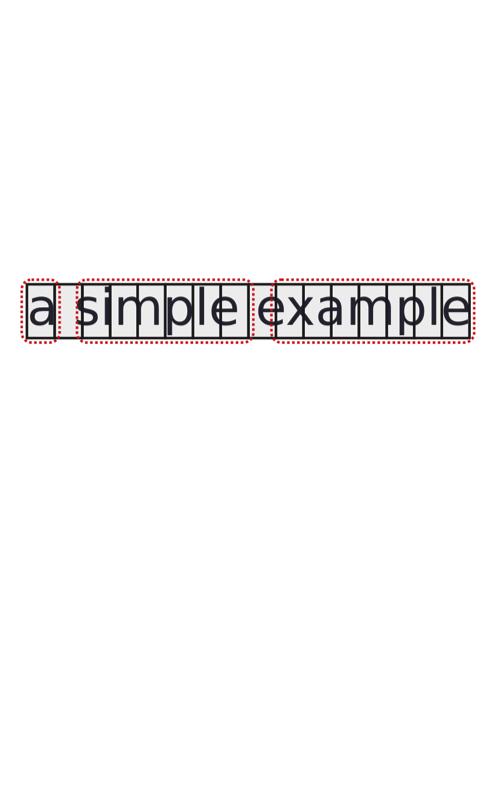

.. meta::
   :description: Orange Textable documentation, strings, segments, and
                 segmentation
   :keywords: Orange, Textable, documentation, strings, segments, segmentation

Strings, segments, and segmentations
====================================

The main purpose of Orange Textable is to turn text strings into data tables.
As we will see, there are several methods for importing text strings, the
simplest of which is keyboard input using widget
:ref:`Text Field` (see also :doc:`Keyboard input, widget labelling and segmentation
display <keyboard_input_segmentation_display>` or 
:doc:`Cookbook: Import text from keyboard <import_text_keyboard>`.
Whenever a new string is imported, it is assigned a unique identification number 
(called *string index*) and stays in memory as long as the widget that imported 
it.

Consider the following string of 16 characters (note that whitespace counts as
a character too).

.. _strings_segments_segmentations_fig1 :

	
Figure 1 : A simple string.

What makes the transition from text strings to data tables possible is the concept of a segmentation. 
What is a segmentation ?  A segmentation is a string analysis based on a ordered list of segments. 
For instance, a string like "a simple example" above can be analyzed in many different ways: 
it consists of 3 words but also 16 characters, 14 letters, 6 vowels, 3 e's, 2 mple's, etc. 

In the previous example, all the segments of a given segmentation refer to the same string. 
However, a segmentation can span several strings. 
Thus, the segments of a segmentation can cover different strings, as in the example below, where the segmentation "a", "simple", "plan" 
spans two strings ("a simple example" and "what's the plan"). 
All segments referring to a given string must be grouped together, in the order in which they appear in the string. 

.. _strings_segments_segmentations_fig2 :

.. figure:: figures/a_simple_plan.png
   :align: center
   :alt: example2
   :scale: 80 %

Figure 2 : A segmentation can span several strings.

See also
--------

* :doc:`Getting started: Keyboard input and segmentation display
  <keyboard_input_segmentation_display>`
* :doc:`Cookbook: Import text from keyboard <import_text_keyboard>`
