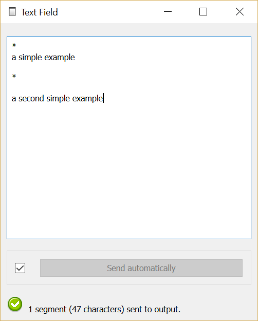

.. meta::
   :description: Orange Textable documentation, Text Field widget
   :keywords: Orange, Textable, documentation, Text Field, widget

.. _Text Field:

Text Field
==========

Import text data from keyboard input.

Signals
-------

Inputs:

* ``Text data``

  Segmentation containing text to be edited

Outputs:

* ``Text data``

  Segmentation covering the input text
  
Description
-----------

This widget allows the user to import keyboard collected data. It emits a
segmentation containing a single unannoted segment covering the whole string.
Secondarily, **Text Field** can be used to manually edit a previously imported
string.

The interface of the widget is divided in two zones (see :ref:`figure 1
<text_field_fig1>` below). The upper part is a text field editable by the
user. The standard editing functions (copy, paste, cancel, etc.) are
accessible through a right-click on the field.

.. _text_field_fig1:

    Figure 1: Interface of the *Text field* widget.

The **Field** section allows the user to copy or manually edit texts. The text can be segmented using a character.

The **Send** button triggers the emission of a segmentation to the output
connection(s). When it is selected, the **Send automatically** checkbox
disables the button and the widget attempts to automatically emit a
segmentation at every modification of its interface (editing of the text or
label modification).

It should be noted that the text field's content is normalized in three ways:

* it is systematically converted to Unicode
* it is subjected to the `canonical Unicode decomposition-recomposition 
  <http://unicode.org/reports/tr15>`_ technique (Unicode sequences such as 
  ``LATIN SMALL LETTER C (U+0063)`` + ``COMBINING CEDILLA (U+0327)`` are 
  systematically replaced by the combined equivalent, e.g. ``LATIN SMALL LETTER 
  C WITH CEDILLA (U+00C7)``)
* various forms of line endings (in particular ``\r\n`` and ``\r``) are 
  converted to a single form (namely ``\n``) 

When an instance of **Text Field** receives a segmentation on an incoming
connection, the contents of all incoming segments are concatenated (without
adding any delimiters) and the resulting string replaces the current textual
content of the widget (if any). This allows the user to manually edit text
that has been previously imported in Orange Textable. Some points are worth
noting:

* This operation creates a distinct string from the one that has been
  previously imported: it really amounts to *copying* the original string and
  making the copy available for manual edition. As such, it is prone to a very
  specific and possibly disconcerting type of error, which can be best
  understood by studying the example given in the documentation of
  :ref:`Preprocess` (section :ref:`anchor_to_caveat`), where what is said
  about :ref:`Preprocess` also applies to **Text Field**.
  
* Modifications brought from within the interface of **Text Field** to a
  string imported in this way will be lost if the **Text Field** instance
  receives a new input on its incoming connection. In particular, this will
  happen if the schema is saved and later re-opened. To avoid any loss of
  data, the safest way to operate is to remove the incoming connection
  as soon as it has been created and the string has been copied in the
  **Text Field** instance's interface; indeed, removing the incoming
  connection will not remove the imported string from the instance's
  interface, where it can then be edited without risking to overwrite it.

Messages
--------

Information
~~~~~~~~~~~

*Data correctly sent to output: 1 segment (<n> characters).*
    This confirms that the widget has operated properly.

*No data sent to output yet: text field is empty.*
    The widget instance is not able to emit data to output because no text has
    been entered in the text field.

Examples
--------

* :doc:`Getting started: Keyboard input and segmentation display
  <keyboard_input_segmentation_display>`
* :doc:`Cookbook: Import text from keyboard <import_text_keyboard>`

See also
--------

* :doc:`Getting started: Merging segmentations together
  <merging_segmentations_together>`
* :doc:`Getting started: Annotating by merging <annotating_merging>`
* :doc:`Getting started: Converting XML markup to annotations
  <converting_xml_markup_annotations>`
* :ref:`Reference: Preprocess (section "Caveat") <anchor_to_caveat>`

