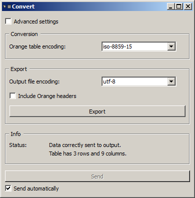

Converting between table formats
================================

Orange Canvas has a "native" type for representing data tables, namely
*ExampleTable*. However, this type does not support Unicode well, which is
a serious limitation in the perspective of text processing. To overcome this
issue (as much as possible), Orange Textable defines its own table
representation format, simply called *Table*.

Every :doc:`table construction widget <table_construction_widgets>` in Orange
Textable emits data in *Table* format. Instances of these widget must then
be connected with an instance of :ref:`Convert`, which has mainly
two purposes:

    -   It *converts* data in Orange Textable's *Table* format to the native
        *ExampleTable* format of Orange Canvas, which makes it possible to
        use the other widgets of Orange Canvas for visualizing, modifying,
        analyzing, etc. tables built with Orange Textable.
        
    -   It *exports* data in *Table* format to text files, in tab-delimited
        format, typically in order to import them later in a third party data
        analysis software package; at the time of writing, this scenario is
        the only way to correctly visualize a table containing data encoded in
        Unicode.
        
As shown on :ref:`figure 1 <converting_table_formats_fig1>` below, section
*Conversion* of the widget's interface lets the user choose the encoding
of the *ExampleTable* object produced in output (**Orange table encoding**);
variants of Unicode should be avoided here since they are currently not well
supported by other widgets in Orange Canvas.

.. _converting_table_formats_fig1:

    Figure 1: Basic interface of widget :ref:`Convert`.

The encoding for text file export can be selected in the *Export* section
(**Output file encoding**); in this case there are no counter-indications to
the use of Unicode. Checkbox **Include Orange headers** triggers inclusion of
additional table headers in the case where the output file should be later
re-imported in Orange Canvas. Export proper is performed by clicking the
**Export** button and selecting the output file in the dialog that appears.

The take-home message here is this: when you create an instance of a
:doc:`table construction widget <table_construction_widgets>`, you may
systematically create a new instance of :ref:`Convert` and connect
them together. Usually, moreover, you will want to connect the
:ref:`Convert` instance to a *Data Table* instance (from the *Data*
tab of Orange Canvas) in order to view the table just built--except in the
case where it contains Unicode data that wouldn't display correctly in
*Data table*.

