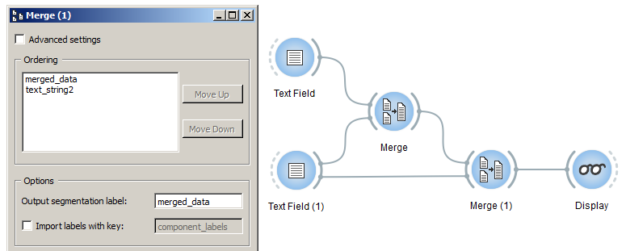

Merging segmentations together
==============================

Computerized text analysis often implies consolidating various text sources
into a single *corpus*. In the framework of Orange Textable, this amounts
to grouping segmentations together, and it is the purpose of the
:doc:`Merge <merge>` widget.

To try out this widget, create on the canvas two instances of
:doc:`Text Field <text_field>`, an instance of :doc:`Merge <merge>` and an
instance of :doc:`Display <display>` (see
:ref:`figure 1 <merging_segmentations_together_fig1>` below). Type
a different string in each :doc:`Text Field <text_field>` instance (e.g.
*a simple example* and *another example*) and assign it a distinct label (e.g.
*text_string* and *text_string2*). Eventually, connect the instances as
shown on :ref:`figure 1 <merging_segmentations_together_fig1>`.

.. _merging_segmentations_together_fig1:

.. figure:: figures/merge_example_scheme.png
    :align: center
    :alt: Scheme illustrating the usage of widget Merge
    :figclass: align-center

    Figure 1: Grouping *a simple example* with *another example* using widget :doc:`Merge <merge>`.

The interface of widget :doc:`Merge <merge>` (see
:ref:`figure 2 <merging_segmentations_together_fig2>` below) illustrates a
feature shared by most Orange Textable widgets: the **Advanced settings**
checkbox triggers the display of more complex controls offering more
possibilities to the user. For now we will stick to the basic settings and
leave the box unchecked.

.. _merging_segmentations_together_fig2:

.. figure:: figures/merge_example.png
    :align: center
    :alt: Interface of widget merge
    :figclass: align-center

    Figure 2: Interface of widget :doc:`Merge <merge>`.
    
Section **Ordering** of the widget's interface lets the user view the labels
of incoming segmentations and control the order in which they will appear in
the output segmentation (by selecting them and clicking on **Move Up** /
**Down**). The **Output segmentation label** can be set in section
**Options**. We will return :doc:`later <annotating_merging>` to the purpose
of checkbox **Import labels with key**; leave it unchecked for now.

.. _merging_segmentations_together_fig3:

.. figure:: figures/display_merged_example.png
    :align: center
    :alt: Displaying a merged segmentation
    :figclass: align-center

    Figure 3: Merged segmentation.

:ref:`Figure 3 <merging_segmentations_together_fig3>` above shows the
resulting merged segmentation, as displayed by widget
:doc:`Display <display>`. As can be seen, :doc:`Merge <merge>` makes it easy
to concatenate several strings into a single segmentation. If the incoming
segmentations contained several segments, each of them would appear in the
output segmentation, in the order specified under **Ordering** (and, within
each incoming segmentation, in the original order of segments).

.. _merging_segmentations_together_ex1:

**Exercise 1:** Can you add a new instance of :doc:`Merge <merge>` to the
scheme illustrated on :ref:`figure 1 <merging_segmentations_together_fig1>`
above and modify the connections (but not the configuration of existing
widgets) so that the segmentation given in
:ref:`figure 4 <merging_segmentations_together_fig1>` below appears in the
:doc:`Display <display>` widget?
(:ref:`solution <solution_merging_segmentations_together_ex1>`)

.. _merging_segmentations_together_fig4:

.. figure:: figures/goal_exercise_merge.png
    :align: center
    :alt: 3 segments: "a simple example", "another example", "another example"
    :figclass: align-center

    Figure 4: The segmentation requested in :ref:`exercise 1 <merging_segmentations_together_ex1>`.

.. _solution_merging_segmentations_together_ex1:

**Solution to exercise 1:** (:ref:`back to the exercise <merging_segmentations_together_ex1>`)

    Figure 5: Solution to :ref:`exercise 1 <merging_segmentations_together_ex1>`.

