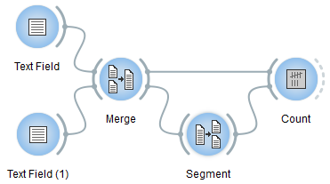
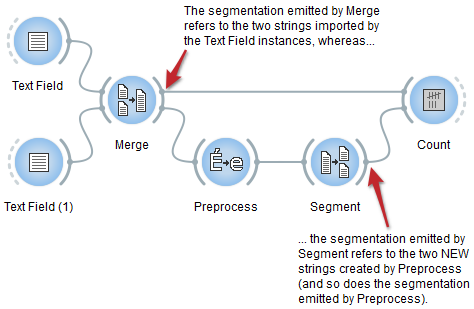
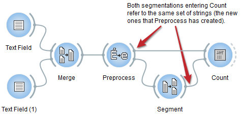

.. _Preprocess:

Preprocess
==========

.. image:: figures/Preprocess_54.png

Basic text preprocessing.

Signals
-------

Inputs:

* ``Segmentation``

  Segmentation covering the text to be preprocessed

Outputs:

* ``Text data``

  Segmentation covering the modified text

Description
-----------

This widget inputs a segmentation, creates a modified copy of the content of
the segmentation, and outputs a new segmentation corresponding to the modified
data. The possible modifications are on the case (lower case/upper case) and
the replacing of accentuated characters by their non-accentuated equivalents.

.. _preprocess_fig1:

.. figure:: figures/preprocess_advanced_example.png
    :align: center
    :alt: Interface of the Preprocess widget
    :figclass: align-center

    Figure 1: Interface of the **Preprocess** widget.

Note that **Preprocess** creates a copy of each modified segment, which
increases the program's memory footprint; moreover this widget can only work
on segmentations without any overlap, which means no part of the text is
covered by more than one segment.

In the **Preprocessing** section of its interface (see :ref:`figure 1
<preprocess_fig1>` above), the **Transform case** checkbox triggers the
systematic modification of the case: select **to lower** to convert every
character to lower case and **to upper** to convert them to upper case. The
**Remove accents** checkbox controls the replacement of accentuated character
by their non-accentuated equivalents (é -> e, ç -> c, etc.).

The **Options** section enables the user to define the label of the output
segmentation (**Output segmentation label**). The **Copy annotations** button
copies all the annotations of the input segmentation to the output
segmentation; it is only accessible when the **Advanced settings** checkbox is
selected (otherwise the annotations are by default copied).

The **Info** section indicates the number of segments present in the output
segmentation, or the reasons why no segmentation is emitted (no input data,
overlaps in the input segmentation, etc.).

The **Send** button triggers data emission, as it happens a segmentation, to
the output connection(s). When it is selected, the **Send automatically**
checkbox deactivates the button and the widget attempts to automatically emit
a segmentation at every modification of its interface (editing of the text or
label modification) or when its input data are modified (by deletion or
addition of a connection, or because modified data is received through an
existing connection).

Caveat
------

As one of the rare widgets of Textable that do create new *strings* and not
only new *segmentations* (the only other one being :ref:`Recode`),
**Preprocess** is prone to a very specific and possibly disconcerting type of
error, which can be best understood by studying an example.

Suppose that you wish to count word frequency in the content of two
:ref:`Text Field` instances--a scenario similar to that illustrated in section
:doc:`Counting in specific contexts <counting_specific_contexts>`. You could
use :ref:`Merge` to combine the :ref:`Text Field` instances' output in a
single segmentation (see :ref:`figure 2 <preprocess_fig2>` below), then
segment the latter into words with :ref:`Segment`. You would eventually
feed both the segmentation emitted by :ref:`Segment` (specifying units) and
by :ref:`Merge` (specifying contexts) to an instance of :ref:`Count` for
building the frequency table.

.. _preprocess_fig2:

    Figure 2: Counting words in the content of two :ref:`Text Field` instances.

Moreover, suppose that you want to convert the input texts to lower case
before counting word frequency. An intuitive way of performing this is by
inserting a **Preprocess** instance between :ref:`Merge` and :ref:`Segment` as
on :ref:`figure 3 <preprocess_fig3>` below. However, because **Preprocess**
creates a *new* string for each input segment and emits a segmentation that
refers to these new strings, this raises a rather insidious issue.

.. _preprocess_fig3:

    Figure 3: WRONG way of inserting a **Preprocess** instance in the schema.

To no effect, :ref:`Count` will attempt to find occurrences of the units
specified by the segmentation received from :ref:`Segment` in the contexts
specified by the segmentation received from :ref:`Merge`; since those actually
belong to distinct strings, none of these units occurs in any of these
contexts and the frequency table will remain hopelessly empty.

Luckily, a small wiring modification suffices to entirely solve the problem:
the connection between :ref:`Merge` and :ref:`Count` should simply be replaced
by a *direct* connection between **Preprocess** and :ref:`Count`, as on
:ref:`figure 4 <preprocess_fig4>` below. This way, units and contexts refer
to the same set of strings and occurrences of the ones can be properly counted
in the others.

.. _preprocess_fig4:

    Figure 4: RIGHT way of inserting **Preprocess**.

