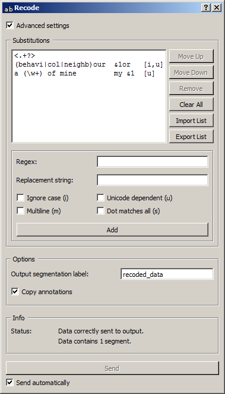

.. _Recode:

Recode
======

.. image:: figures/Recode_54.png

Custom text recoding using regular expressions.

Signals
-------

Inputs:

* ``Segmentation``

  Segmentation covering the text that should be recoded

Outputs:

* ``Recoded text data``

  Segmentation covering the recoded text

Description
-----------

This widget inputs a segmentation, creates a modified copy of its content, and
outputs a new segmentation corresponding to the modified data. The
modifications applied are defined by *substitutions*, namely pairs
composed of a regular expression (designed to identify portions of text that
should be modified) and a replacement string.

It is possible to "capture" text portions using parentheses appearing in the
regular expressions, in order to insert them in the replacement strings, where
sequences ``&1``, ``&2``, etc. correspond to the successive pairs of
parentheses (numbered on the basis of the position of the opening
parenthesis).

Note that **Recode** creates a copy of each modified segment, which
increases the program's memory footprint; moreover this widget can only work
on segmentations without any overlap, which means no part of the text is
covered by more than one segment.

Basic interface
~~~~~~~~~~~~~~~

The basic version of the widget is limited to the application of a single
substitution. Section **Substitution** (see :ref:`figure 1
<recode_fig1>` below) allows the user to specify the regular expression
(**Regex**) and the corresponding replacement string (**Replacement string**).
If the replacement string is left empty, the text parts identified by the
regular expression will simply be deleted; it is the case in the example of
:ref:`figure 1 <recode_fig1>`, which leads to the deletion of XML/HTML
tags. [#]_

.. _recode_fig1:

.. figure:: figures/recode_basic_example.png
    :align: center
    :alt: Basic interface of the Recode widget
    :figclass: align-center

    Figure 1: **Recode** widget (basic interface).

The **Options** section allows the user to define the output segmentation
label. The annotations of each input segment are systematically copied in the
corresponding output segments (see `Advanced interface`_, option **Copy
annotations**).

The **Info** section indicates the number of segments present in the output
segmentation, or the reasons why no segmentation is emitted (no input data,
overlaps in the input segmentation, etc.).

The **Send** button triggers data emission, as it happens a segmentation, to
the output connection(s). When it is selected, the **Send automatically**
checkbox disables the button and the widget attempts to automatically emit
a segmentation at every modification of its interface or when its input data
are modified (by deletion or addition of a connection, or because modified
data is received through an existing connection).

Advanced interface
~~~~~~~~~~~~~~~~~~

In its advanced version, the **Recode** widget allows the user to define
several substitutions and to determine the order in which they should
successively be applied to each segment of the input segmentation.

.. _recode_fig2:

    Figure 2: **Recode** widget (basic interface).

The advanced interface (see :ref:`figure 2 <recode_fig2>` above) presents
similarities with that of the :ref:`Text Files`, :ref:`URLs`, and
:ref:`Segment` widgets. The **Substitutions** section allows the user to
define the substitutions applied to each successive input segment and to
determine their application order. In the list displayed at the top of the
window, each line specifies a substitution, and the columns indicate for each
substitution (a) the corresponding regular expression, (b) the (possibly
empty) replacement string, and (c) the options associated with the regular
expression. [#]_

On :ref:`figure 2 <recode_fig2>` above, we can see that three substitutions
have been specified. The first deletes XML/HTML tags (it replaces them with
the empty string). The second replaces occurrences of British English forms
(*behaviour*, *colour*, and *neighbour*, possibly capitalized, since the
*Ignore case* option is selected) with their American English variants
(*behavior*, *color*, and *neighbor*), while the last replaces sequences
like *a X of mine* with *my X*; thus they illustrate the possibility to
"capture" text portions through parentheses appearing in the regular
expression.

To take a concrete example, the successive application of these three
substitutions to string

::

 	<example>I've just met a neighbour of mine.</example>

will produce in turns the modified versions

::

    I've just met a neighbour of mine.

::

    I've just met a neighbor of mine.

::

    I've just met my neighbor.

The first buttons on the right of the substitution list allow the user to
modify the order in which they are successively applied to each segment of the
input segmentation (**Move Up** and **Move Down**), to delete a substitution
from the list (**Remove**) or to empty it entirely (**Clear All**). Except for
**Clear All**, all of these buttons require the selection of an entry in the
list beforehand. **Import List** enables the user to import a list of
substitutions in JSON format (see :doc:`JSON im-/export format <json_format>`)
and to add them to those already selected. **Export List** enables the
user on the contrary to export the list of substitutions in a JSON format
file.

The remaining part of the **Substitutions** section allows the user to add new
substitutions to the list. To define a new substitution, one must specify the
regular expression (**Regex**) and the corresponding replacement string
(**Replacement string**); the latter can be left empty, in which case the text
portions identified by the regular expression will simply be deleted. The
**Ignore case (i)**, **Unicode dependent (u)**, **Multiline (m)** and **Dot
matches all (s)** checkboxes control the application of the corresponding
options to the regular expression. Adding the new substitution to the list is
achieved by clicking on the **Add** button.

The **Options** section allows the user to define the output segmentation
label. The **Copy annotations** checkbox copies every annotation of the input
segmentation to the output segmentation.

The **Info** section indicates the number of segments present in the output
segmentation, or the reasons why no segmentation is emitted (no input data,
overlaps in the input segmentation, etc.).

The **Send** button triggers data emission, as it happens a segmentation, to
the output connection(s). When it is selected, the **Send automatically**
checkbox disables the button and the widget attempts to automatically emit
a segmentation at every modification of its interface or when its input data
are modified (by deletion or addition of a connection, or because modified
data is received through an existing connection).

Caveat
------

As one of the rare widgets of Textable that do create new *strings* and not
only new *segmentations* (the only other one being :ref:`Preprocess`),
**Recode** is prone to a very specific and possibly disconcerting type of
error, which can be best understood by studying the example given in the
documentation of :ref:`Preprocess` (section :ref:`anchor_to_caveat`), where
all that is said about :ref:`Preprocess` also applies to **Recode**.

.. [#] For more details concerning the regular expression syntax, see the
       `Python documentation <http://docs.python.org/library/re.html>`_.
       Note that option ``-u`` (*Unicode dependent*) is activated by default.

.. [#] For more details on the effect of options ``i``, ``u``, ``m``, and
       ``s``, see the
       `Python documentation <http://docs.python.org/library/re.html>`_.

