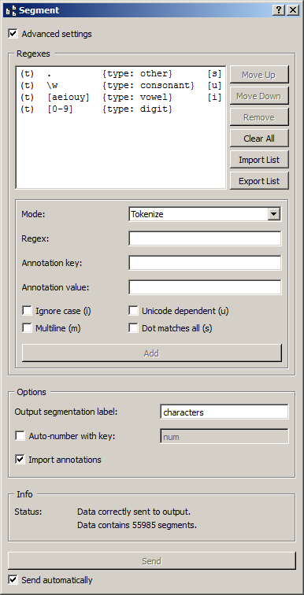

.. _Segment:

Segment
=======

.. image:: figures/Segment_54.png

Subdivide a segmentation using regular expressions.

Signals
-------

Inputs:

* ``Segmentation``

  Segmentation that should be further segmented

Outputs:

* ``Segmented data``

  Segmentation containing the newly created segments

Description
-----------

This widget inputs a segmentation and creates a new segmentation by
subdividing each original segment into a series of new segments. By default,
it works on the basis of a description of the form of the new segments (by
means of regular expressions); alternatively, it can also operate based on a
description of the separators that appear in-between the segments. It also
allows the user to create annotations for the output segments.

In the same way as for the :ref:`Recode` widget, it is possible to "capture"
text portions with square brackets used in a regular expression, notably to
copy them in the annotation key and/or in the associated value; for this we
use the notations ``&1``, ``&2``, etc. corresponding to the pairs of
successive brackets (numbered on the basis of the position of opening
parentheses) of the regular expression. [#]_

Basic interface
~~~~~~~~~~~~~~~

The basic version of the widget is limited to the application of a single
regular expression, specified in the Regex section (see :ref:`figure 1
<segment_fig1>` below). The expression given as an example (``\w+``) creates a
segment for each word of each input segment (to be precise: each continuous
sequence of alphanumerical characters and underscores). [#]_

.. _segment_fig1:

.. figure:: figures/segment_example.png
    :align: center
    :alt: Basic interface of the Segment widget
    :figclass: align-center

    Figure 1: **Segment** widget (basic interface).

The **Options** section allows the user to define the output segmentation
label. The annotations of each input segment are systematically copied in the
corresponding output segments (see `Advanced interface`_, option **Import
annotations**).

The **Info** section indicates the number of segments in the output
segmentation, or the reasons why no segmentation is emitted (no input data,
overlaps in the input segmentations, etc.).

The **Send** button triggers data emission, as it happens a segmentation, to
the output connection(s). When it is selected, the **Send automatically**
checkbox disables the button and the widget attempts to automatically emit
a segmentation at every modification of its interface or when its input data
are modified (by deletion or addition of a connection, or because modified
data is received through an existing connection).

Advanced interface
~~~~~~~~~~~~~~~~~~

In its advanced version, the widget enables the user to define several regular
expressions and to determine the order in which they should successively be
applied to each segment of the input segmentation. It also allows the user to
specify if a given regular expression describes the form of the targeted
segments (**Tokenize** mode) or rather the form of the separators in-between
these segments (**Split** mode). [#]_

.. _segment_fig2:

    Figure 2: **Segment** widget (advanced interface).

The advanced interface (see :ref:`figure 2 <segment_fig2>` above) presents
similarities with that of the :ref:`Text Files`, :ref:`URLs`, and
:ref:`Recode` widgets. The **Regexes** section allows the user to define the
regular expressions applied successively to each segment of the input
segmentation and to determine their application order. In the list which
appears on top of the window, the columns indicate (a) the mode associated to
this regular expression, namely *t* for *Tokenize* (default) or *s* for
*Split*, (b) the actual expression, (c) the corresponding annotation (if any),
and (d) the options associated to this expression.

On :ref:`figure 2 <segment_fig2>` above, we can thus see that four regular
expressions have been defined, each in the **Tokenize** mode; each identifies
a type of character in the input segmentation and assigns to it an annotation
whose key is type. The character classes identified by the four expressions
are not mutually exclusive, however after having successively applied them,
the widget automatically sorts the segments and fuses those whose addresses
are identical--exactly like the **Sort segments** and **Merge duplicate
segments** options of the :ref:`Merge` widget. In the end, each character thus
belongs to a single segment, whose value for the annotation key type is the
last one that was assigned to it according to the regular expressions
application order.

The first of the four expressions (``.``) creates a segment for each character
and assigns the annotation value *other* to it. The second (``\w``) creates a
segment for each alphanumerical character, and assigns the annotation value
*consonant* to it. The last two respectively identify vowels (``[aeiouy]``)
and digits (``[0-9]``) and annotate them as such. To illustrate the mechanism
explained in the previous paragraph, it can be noted that before segment
sorting and duplicate fusion, each vowel of the input segmentation is
associated with three segments whose values for the annotation key type are
(in order) *other*, *consonant*, and *vowel*; after sorting and fusion, only
the last of these values is retained.

The first buttons on the right of the list of regular expressions allow the
user to modify the order in which they are successively applied to each
segment of the input segmentation (**Move Up** and **Move Down**), to delete
an expression from the list (**Remove**) or to empty it entirely (**Clear
All**). Except for **Clear All**, all of these buttons require the selection
of an entry in the list beforehand. **Import List** enables the user to import
a list of regular expressions in JSON format (see :doc:`JSON im-/export format
<json_format>`) and to add them to those already selected. **Export List**
enables the user on the contrary to export the list of regular expressions
in a JSON file.

The remaining part of the **Regexes** section allows the user to add new
regular expressions to the list. To do so, the regular expression should be
specified (**Regex**) as well as, optionally, the annotation key and the
corresponding value (**Annotation key** and **value**). The **Ignore case
(i)**, **Unicode dependent (u)**, **Multiline (m)** and **Dot matches all
(s)** checkboxes control the application of the corresponding options to the
regular expressions. Adding the new regular expression to the list is executed
by finally clicking on the **Add** button.

The **Options** section allows the user to define the output segmentation
label. The **Copy annotations** checkbox copies every annotation of the input
segmentation to the output segmentation.

The **Info** section indicates the number of segments in the output
segmentation, or the reasons why no segmentation is emitted (no input data,
overlaps in the input segmentations, etc.).

The **Send** button triggers data emission, as it happens a segmentation, to
the output connection(s). When it is selected, the **Send automatically**
checkbox disables the button and the widget attempts to automatically emit
a segmentation at every modification of its interface or when its input data
are modified (by deletion or addition of a connection, or because modified
data is received through an existing connection).

Examples
--------

* :doc:`Segmenting data into smaller units <segmenting_data_smaller_units>`
* :doc:`Hierarchical segmentations and performance issues <hierarchical_segmentations_performance_issues>`

See also:

* :doc:`Counting segment types <counting_segment_types>`
* :doc:`Counting in specific contexts <counting_specific_contexts>`
* :doc:`Partitioning segmentations <partitioning_segmentations>`
* :doc:`Using a segmentation to filter another <using_segmentation_filter_another>`
* :doc:`Tagging table rows with annotations <tagging_table_rows_annotations>`

.. [#] This possibility does not apply when the widget is configured to
       identify the separators rather than the segments themselves
       (**Mode: Split**, see `Advanced interface`_).
       
.. [#] It should be noted that the ``-u`` (*Unicode dependent*) option is
       activated by default (see `Python documentation
       <http://docs.python.org/library/re.html>`_).

.. [#] NB: in **Split** mode, empty segments that might occur between two
       consecutive occurrences of separators are automatically removed.
